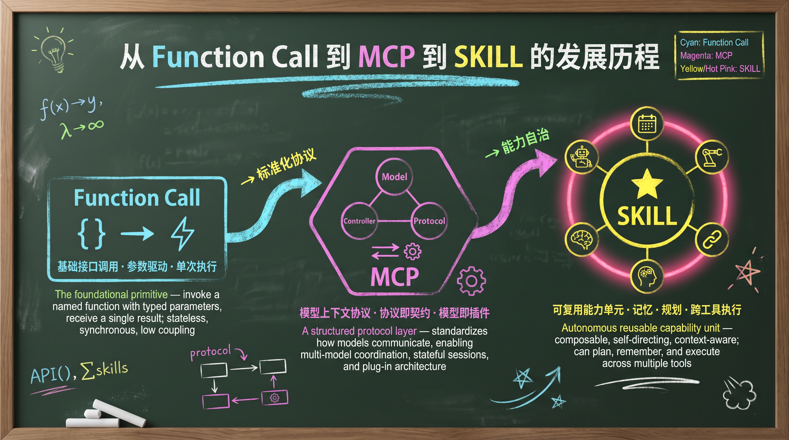
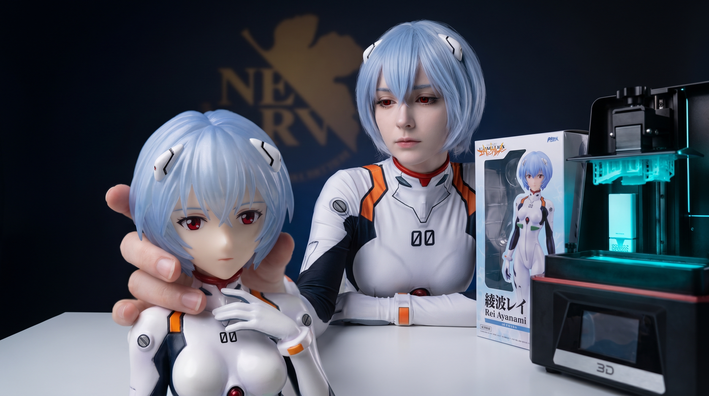
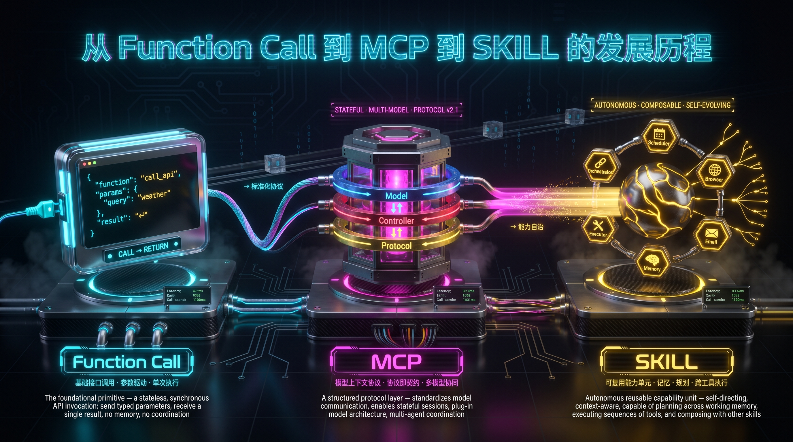
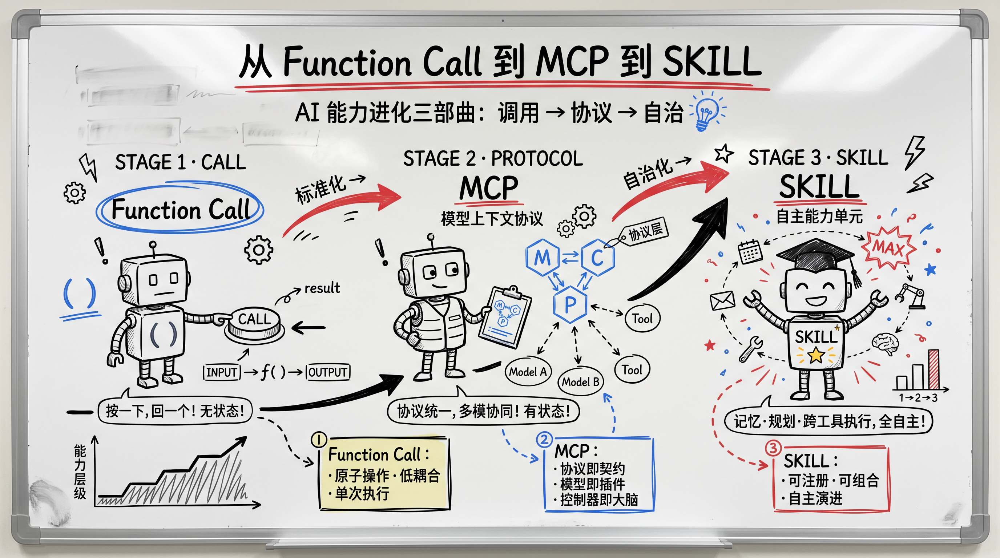
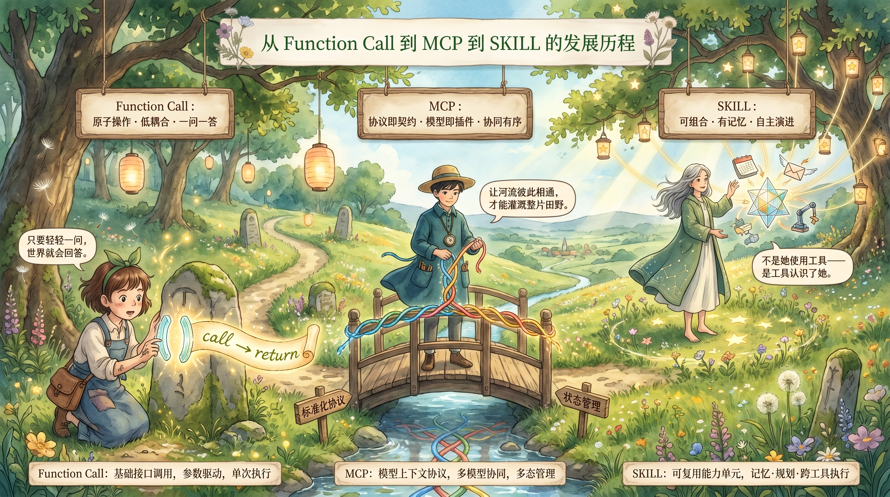
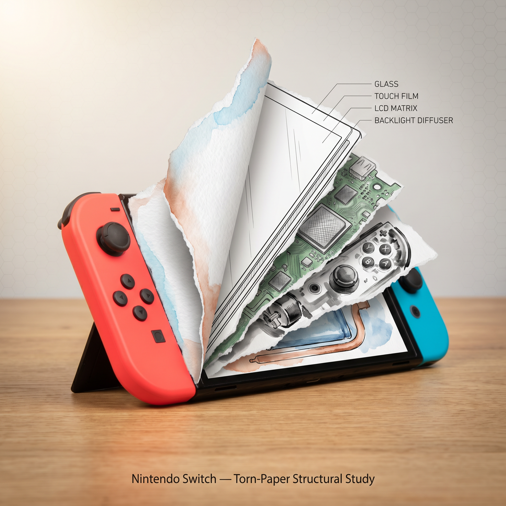
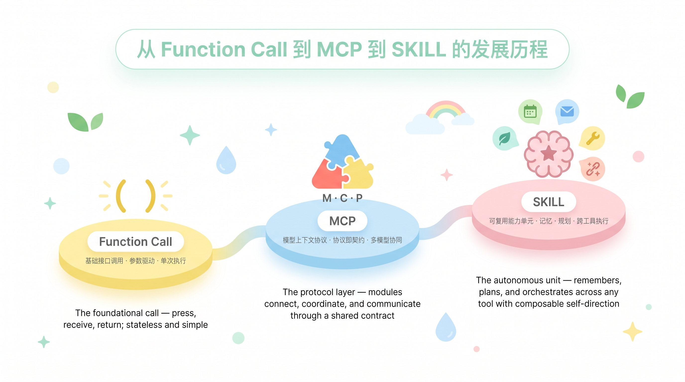
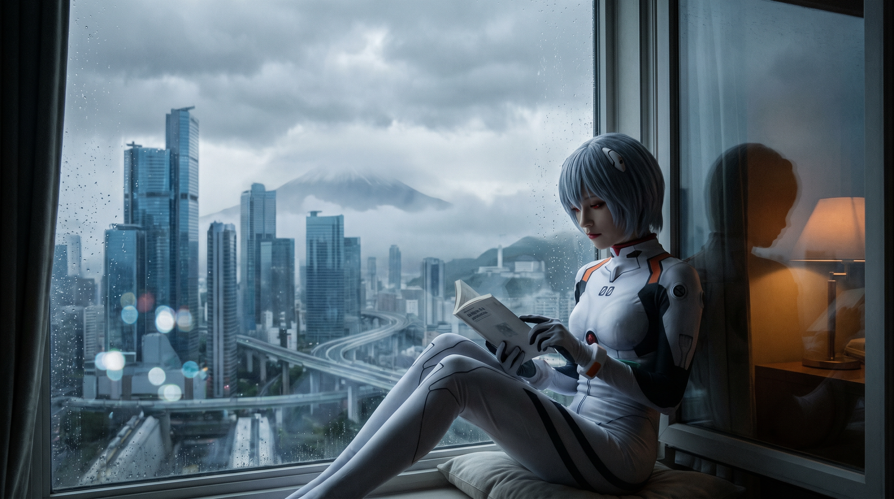
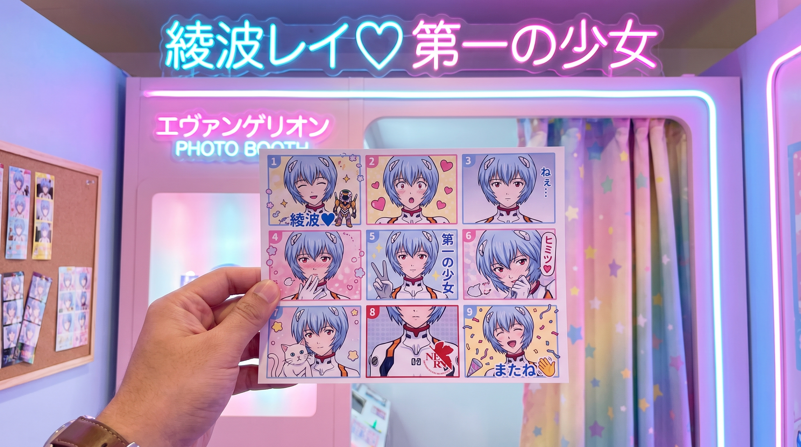
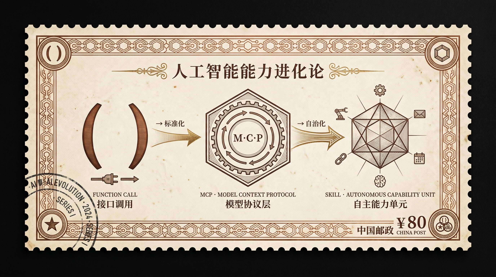

# shiny-skills ✨

[中文](./README.zh.md)

A curated library of skills that make you go "wow" — each one transforms a mundane task into something surprisingly delightful.

## What is a Skill?

A **skill** is a SKILL.md file that an AI agent detects automatically. When a user's request matches the skill's trigger conditions, the agent loads the skill and follows its instructions — no plugins, no setup, just drop the folder into your skills directory.

## Skills

---

### 🎨 [shiny-image-creation-skill](./shiny-image-creation-skill/)

Transforms a one-line description into a fully structured AI image prompt. Supports 27+ visual styles — from Doraemon to Ghibli to Cyberpunk to PS1 Game Case.

**Input:**
```
Create an image showing the evolution from Function Call to MCP to SKILL, chalkboard style, 16:9
```

**Output:** A complete structured prompt ready to paste into Banana2, Midjourney, DALL-E, or Stable Diffusion.

**Style Gallery** (generated with Nano Banana Pro):

| | | | |
|---|---|---|---|
|  |  |  |  |
| Doraemon | Doodle | Chalkboard | Chiikawa |
|  |  |  |  |
| Shin-chan | Vintage Sketchnote | Claymation | Pop Art |
|  |  |  |  |
| Superhero Comic | Anime Figurine | Exploded View | Cyberpunk |
|  |  |  |  |
| Whiteboard | Ghibli | Kawaii Sticker | Character Design Sheet |
|  |  |  |  |
| Torn Paper | Soft Infographic | Fresh Minimalist | Cartoon Flowchart |
|  |  |  |  |
| City Window View | Shounen Manga | AR Annotation | Photo Booth Strip |
|  |  |  | |
| Vintage Stamp | PS1 Game Case | Enamel Pin | |

→ [Full documentation & installation](./shiny-image-creation-skill/)

---

> More skills coming. Contributions welcome.

## Installation

```bash
git clone https://github.com/fluentlc/shiny-skills.git

# Install a specific skill
cp -r shiny-skills/<skill-name> ~/.claude/skills/
```

Each skill directory contains its own README with usage details.

## Contributing

Want to add a new skill? Open a PR — any skill that makes someone's jaw drop is welcome.

## License

MIT
