# shiny-skills ✨

[中文](./README.zh.md)

A curated library of skills that make you go "wow" — each one transforms a mundane task into something surprisingly delightful.

## What is a Skill?

A **skill** is a SKILL.md file that an AI agent detects automatically. When a user's request matches the skill's trigger conditions, the agent loads the skill and follows its instructions — no plugins, no setup, just drop the folder into your skills directory.

## Skills

---

### 🎨 [image-creation-prompt-skill](./image-creation-prompt-skill/)

Transforms a one-line description into a fully structured AI image prompt. Supports 27+ visual styles — from Doraemon to Ghibli to Cyberpunk to PS1 Game Case.

**Input:**
```
Create an image showing the evolution from Function Call to MCP to SKILL, chalkboard style, 16:9
```

**Output:** A complete structured prompt ready to paste into Nano Banana, Midjourney, DALL-E, or Stable Diffusion.

**Style Gallery** (generated with Nano Banana Pro):

|                                                                                 |                                                                                     |                                                                                 |                                                                                             |
| ------------------------------------------------------------------------------- | ----------------------------------------------------------------------------------- | ------------------------------------------------------------------------------- | ------------------------------------------------------------------------------------------- |
| 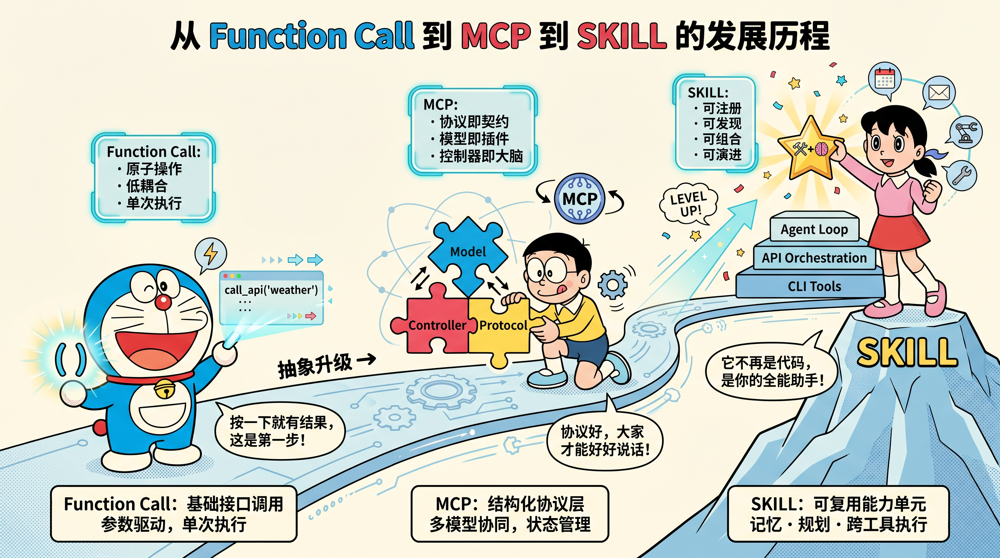                 | 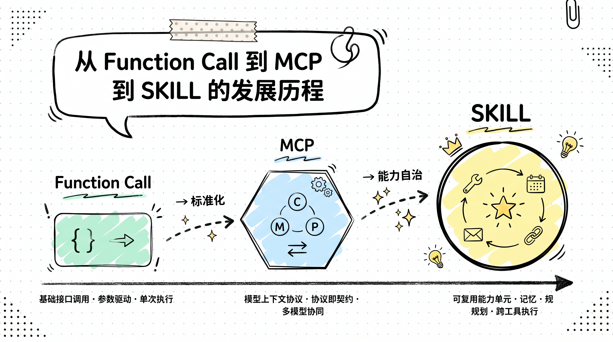                         |              | 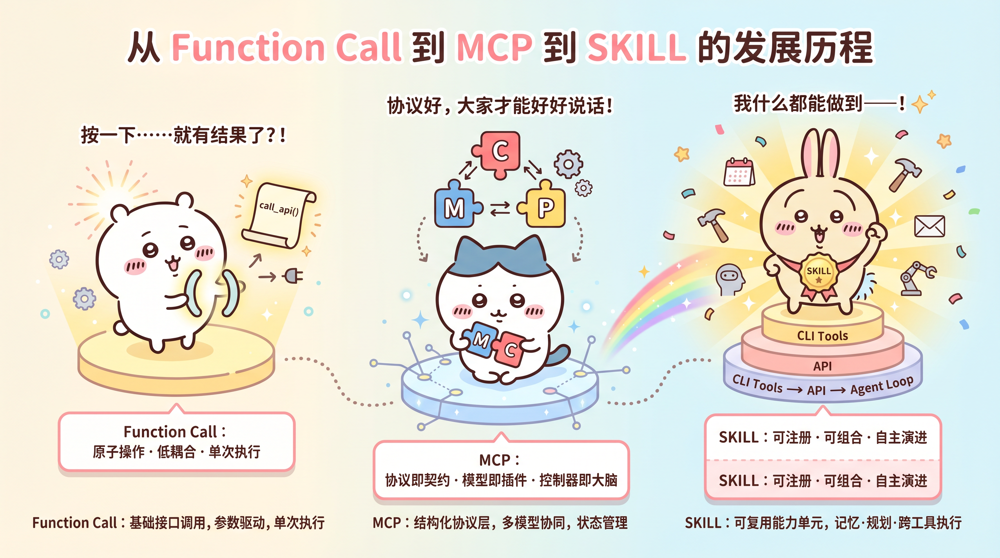                             |
| Doraemon                                                                        | Doodle                                                                              | Chalkboard                                                                      | Chiikawa                                                                                    |
| 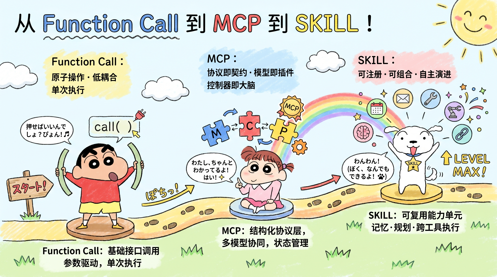                 | 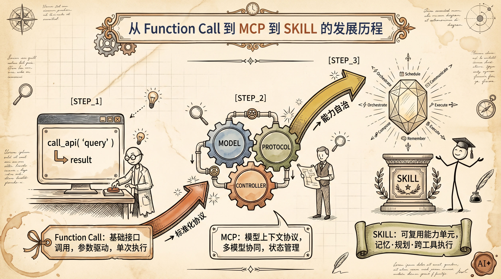 | 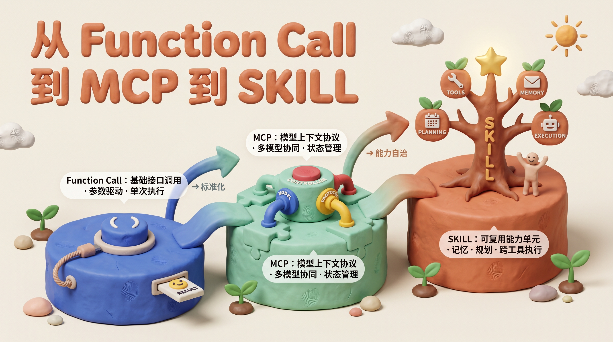             | 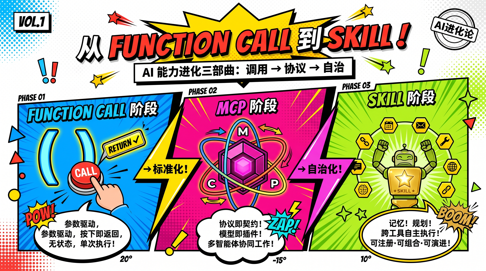       |
| Shin-chan                                                                       | Vintage Sketchnote                                                                  | Claymation                                                                      | Pop Art                                                                                     |
| 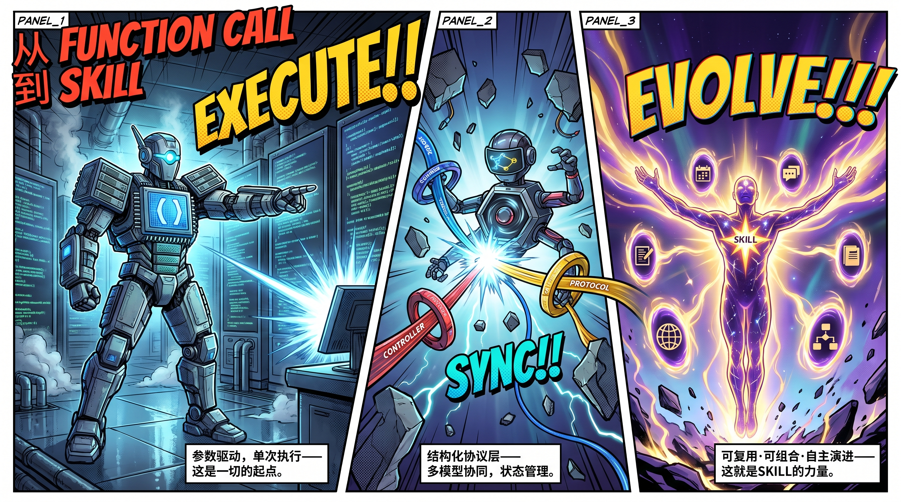   |          | 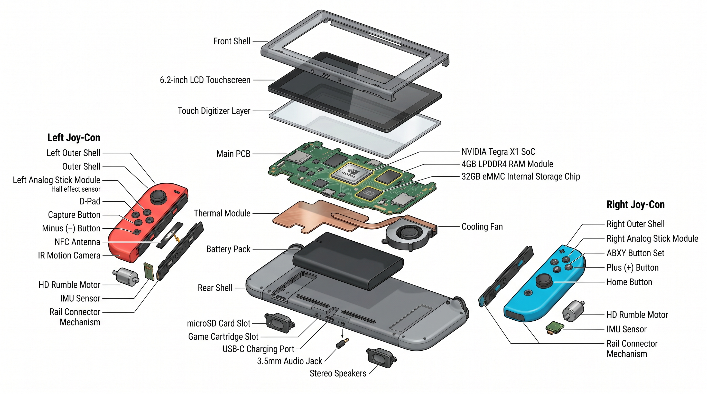       |                            |
| Superhero Comic                                                                 | Anime Figurine                                                                      | Exploded View                                                                   | Cyberpunk                                                                                   |
|              |                          | 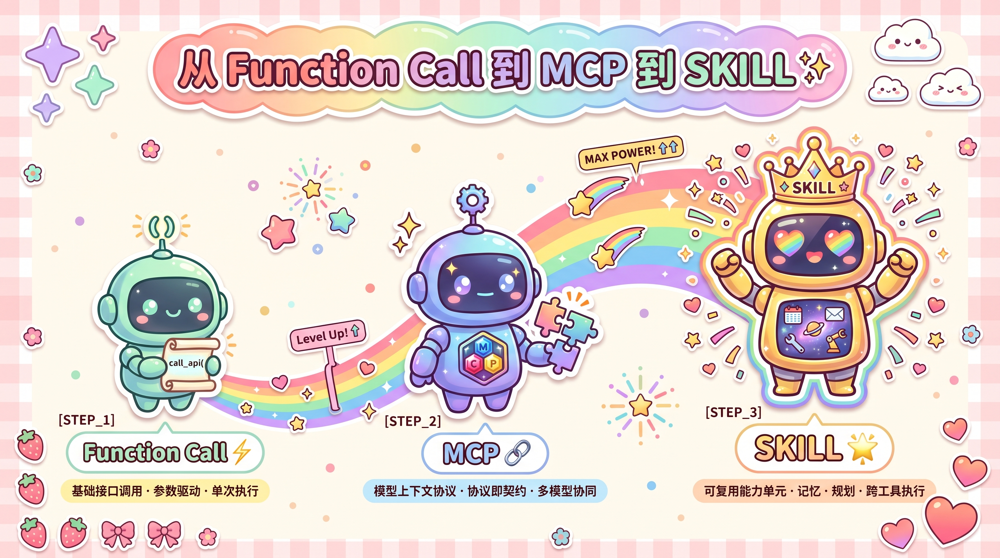     | 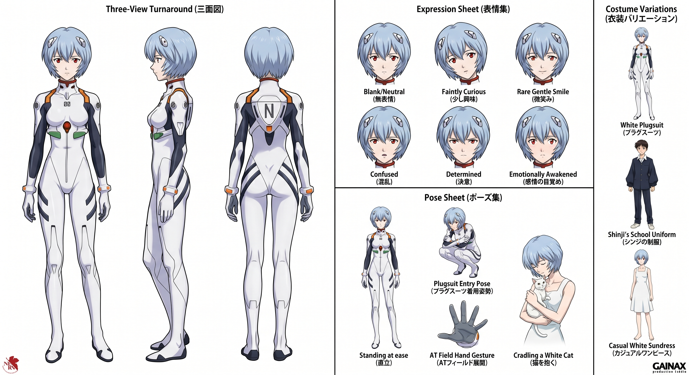 |
| Whiteboard                                                                      | Ghibli                                                                              | Kawaii Sticker                                                                  | Character Design Sheet                                                                      |
|              | 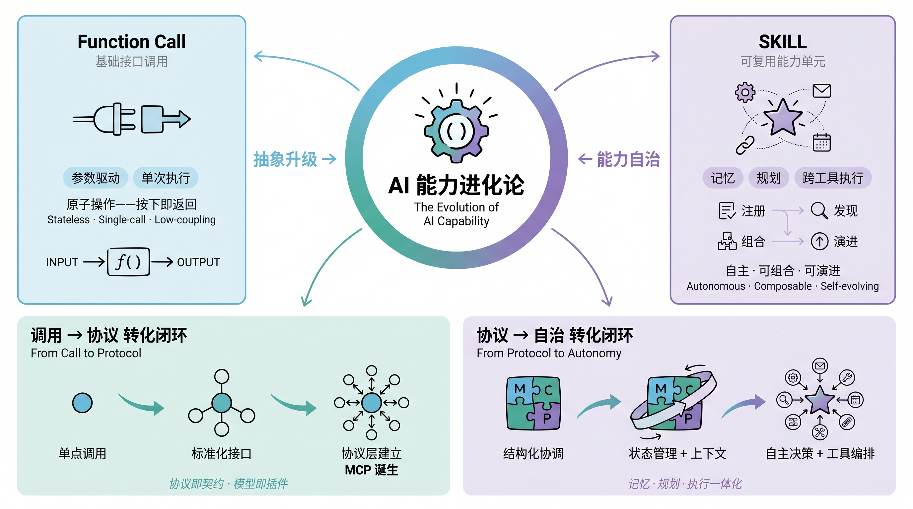     |  | 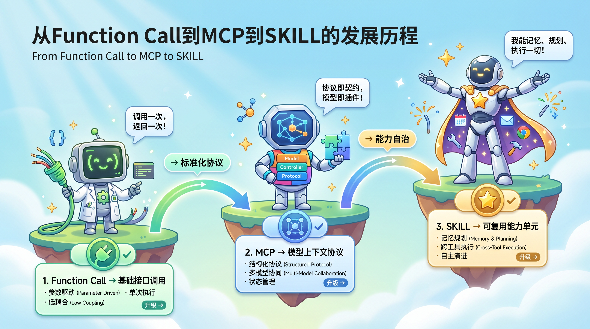           |
| Torn Paper                                                                      | Soft Infographic                                                                    | Fresh Minimalist                                                                | Cartoon Flowchart                                                                           |
|  | 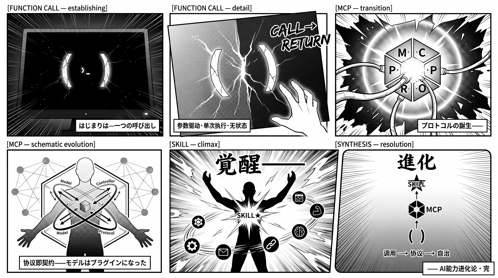           | 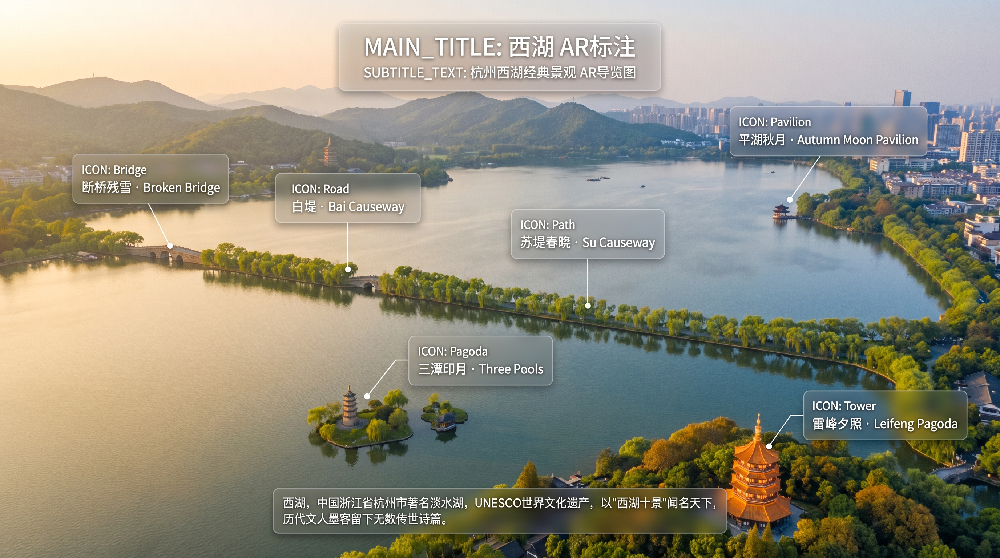       |            |
| City Window View                                                                | Shounen Manga                                                                       | AR Annotation                                                                   | Photo Booth Strip                                                                           |
|        | 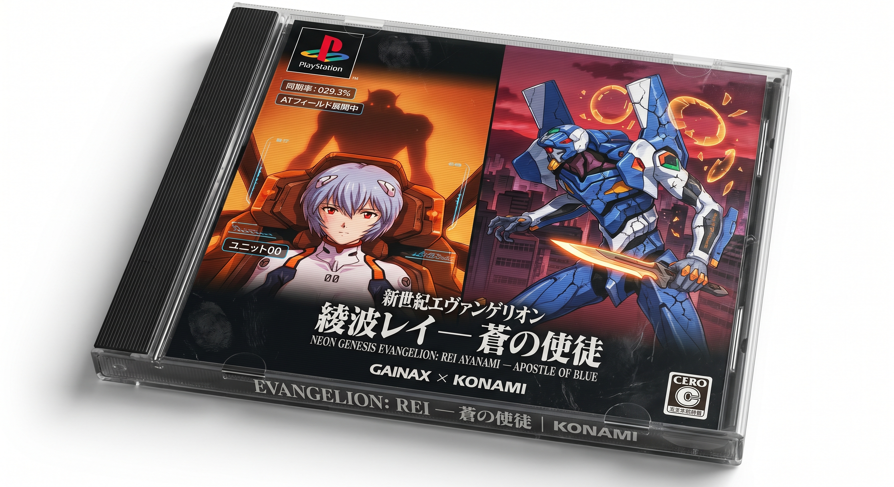           | 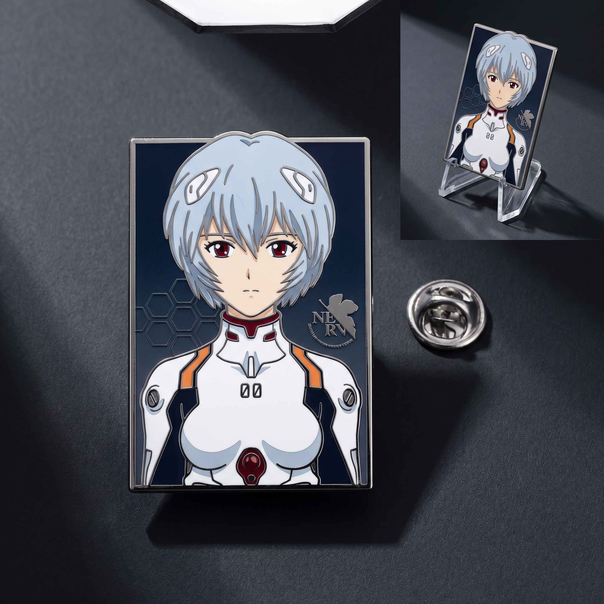             | 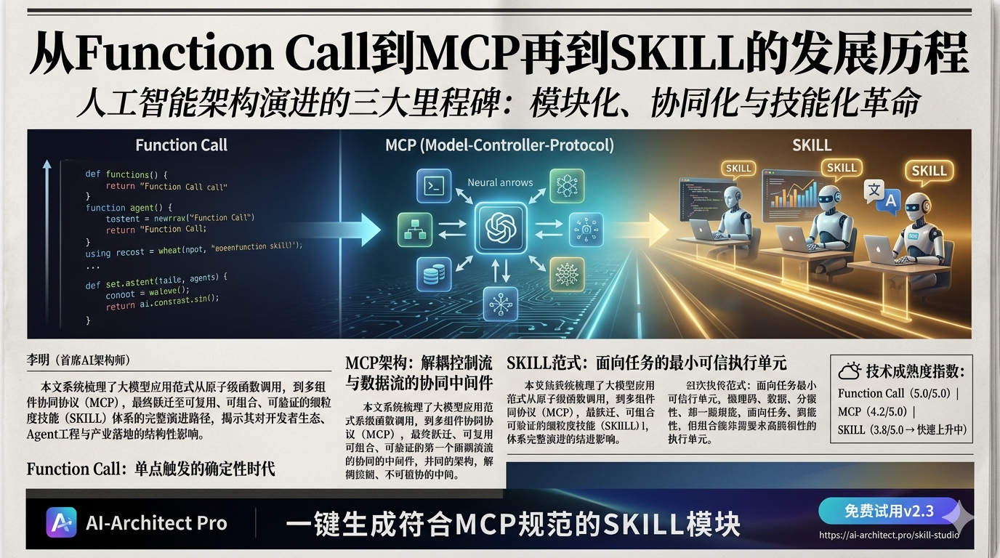           |
| Vintage Stamp                                                                   | PS1 Game Case                                                                       | Enamel Pin                                                                      | Vintage Newspaper                                                                           |

→ [Full documentation & installation](./image-creation-prompt-skill/)

---

> More skills coming. Contributions welcome.

## Installation

```bash
git clone https://github.com/fluentlc/shiny-skills.git

# Install a specific skill
cp -r shiny-skills/<skill-name> ~/.claude/skills/
```

Each skill directory contains its own README with usage details.

## Contributing

Want to add a new skill? Open a PR — any skill that makes someone's jaw drop is welcome.

## License

MIT
