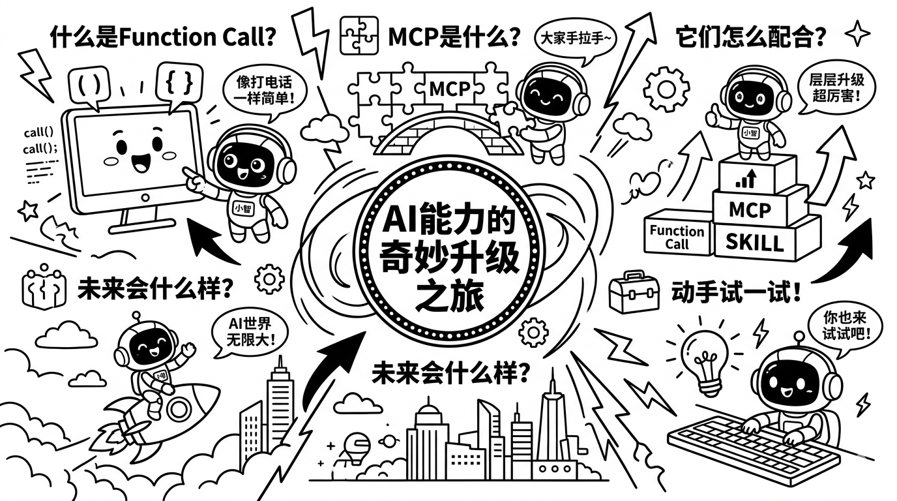
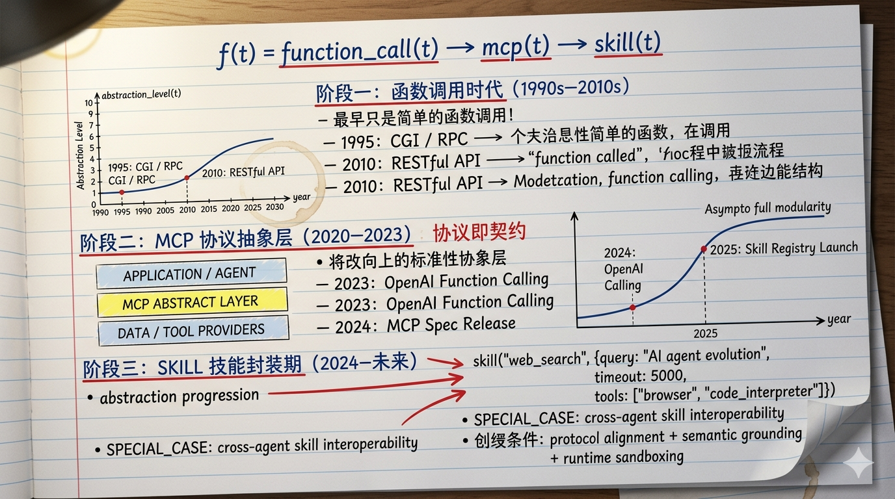
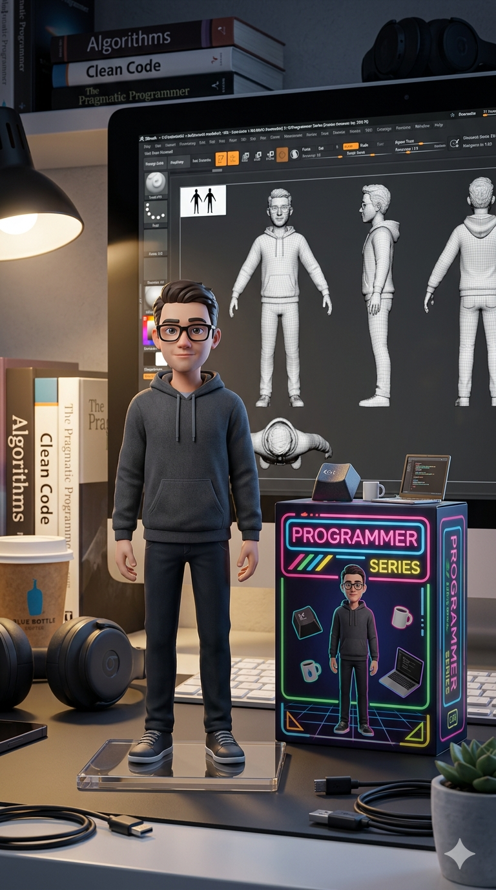
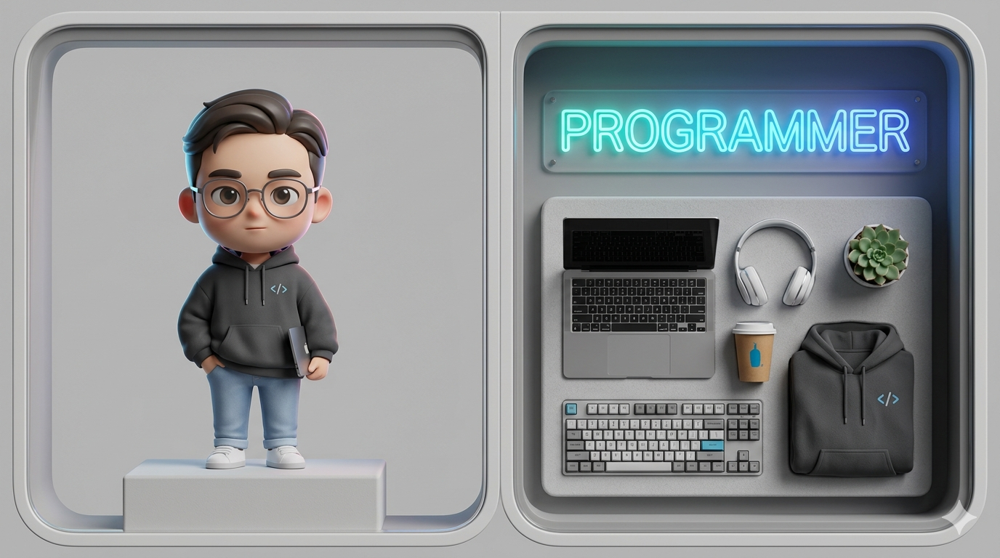
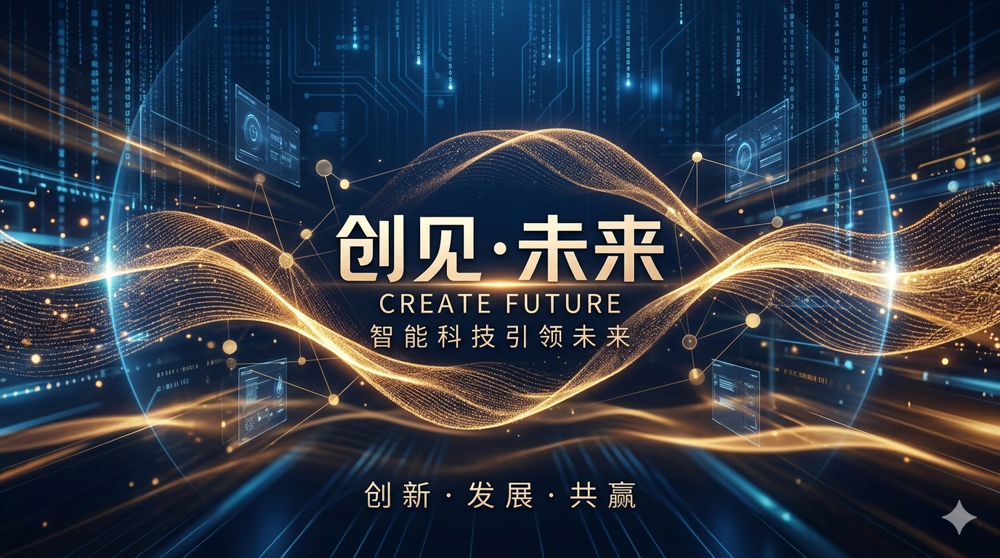
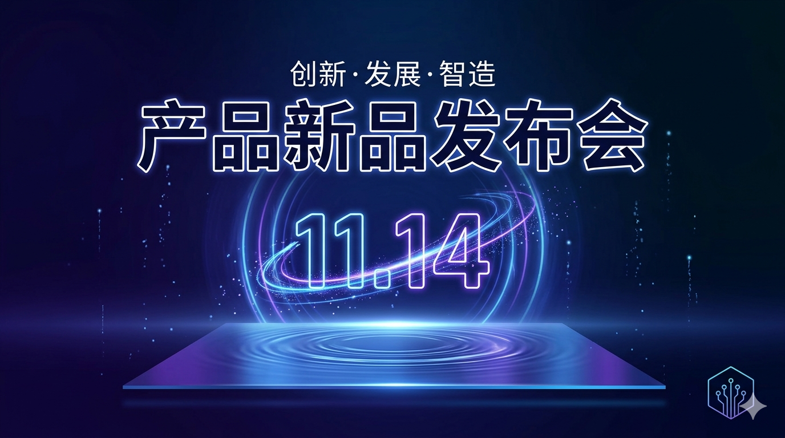

# image-creation-prompt-skill

[English](./README.md)

一个将简单的图像创作描述转化为详细、结构化的 AI 绘图 Prompt 的 Skill。

## 功能

输入一句话——主题、风格、比例——自动生成完整的结构化 Prompt，直接粘贴到 Nano Banana Pro、Midjourney、DALL-E、Stable Diffusion 等工具即可使用。

**输入：**
```
生成一张从Function Call到MCP到SKILL的发展历程图片，哆啦A梦风格，16:9
```

**输出：** 一个完整的结构化 Prompt，涵盖标题排版、场景布局、主体内容、视觉风格、装饰元素、情绪氛围和质量标签。

## 推荐的图像生成工具

此 Skill 生成的 Prompt 经过测试，在以下工具上效果最佳：Nano Banana Pro，也可用于 Midjourney、DALL-E、Stable Diffusion，但风格还原度可能有所差异。

## 安装

此 Skill 依赖 Agent 的文件读取能力（Claude Code / OpenClaw 或同等工具）。需要将整个 Skill 目录复制过去，而非仅 `SKILL.md` 单个文件。

```bash
# 克隆仓库
git clone https://github.com/fluentlc/shiny-skills.git

# 将 skill 目录复制到 Claude Code skills 文件夹
cp -r shiny-skills/image-creation-prompt-skill ~/.claude/skills/
```

## 使用方法

安装后，用自然语言描述你想要的图片：

```
生成一张 [主题]，[风格]，[比例]
```

如 Claude 会自动识别 Skill、匹配风格、加载对应模板并生成 Prompt。

## 支持的风格

| 风格名称                             | 触发关键词                                  | 适合场景                 |
| -------------------------------- | -------------------------------------- | -------------------- |
| 哆啦A梦风格 (Doraemon)                | `哆啦A梦`、`doraemon`、`藤子`                 | 带漫画角色的教育信息图          |
| 简约手绘涂鸦插画风格 (Doodle)              | `手绘`、`涂鸦`、`doodle`、`插画`                | 流程图、教程、轻松风格的说明图      |
| 黑板报风格 (Chalkboard)               | `黑板`、`粉笔`、`chalkboard`                 | 学术概念、课堂风格视觉图         |
| 吉伊卡哇风格 (Chiikawa)                | `吉伊卡哇`、`chiikawa`、`ちいかわ`               | 治愈系角色驱动的温馨科普插图       |
| 蜡笔小新搞怪涂鸦风格 (Shin-chan)           | `蜡笔小新`、`小新`、`shin-chan`                | 搞怪幽默、角色驱动的涂鸦信息图      |
| 复古怀旧手绘插画风格 (Vintage Sketchnote)  | `复古`、`怀旧`、`vintage`、`sketchnote`       | 学术风羊皮纸质感、详细手绘插图      |
| 黏土定格动画风格 (Claymation)            | `黏土`、`定格动画`、`claymation`               | 3D 黏土小剧场风格的教育视觉图     |
| 美式波普漫画风小红书插图风格 (Pop Art)         | `波普`、`小红书`、`pop art`、`漫画`              | 高能量社交媒体信息图、美漫风       |
| 美式超级英雄漫画风格 (Superhero Comic)     | `超级英雄`、`marvel`、`superhero`、`comic`    | 多格漫画分镜、漫威DC风格史诗感     |
| 动漫人物手捧本尊手办风格 (Anime Figurine)    | `手办`、`cosplay`、`figurine`、`本尊手办`       | 超写实角色手持同款手办摄影风格      |
| 物品爆炸视图风格 (Exploded View)         | `爆炸视图`、`结构解析`、`exploded view`          | 工程蓝图风等轴测结构拆解图        |
| 赛博朋克风科普插图风格 (Cyberpunk)          | `赛博朋克`、`cyberpunk`、`霓虹`、`未来`           | 霓虹暗调未来感3D科技信息图       |
| 白板手绘风格科普插画风格 (Whiteboard)        | `白板`、`whiteboard`、`马克笔`                | 课堂白板马克笔手绘风格说明图       |
| 吉卜力风格科普插画 (Ghibli)               | `吉卜力`、`ghibli`、`宫崎骏`、`miyazaki`        | 水彩手绘吉卜力风格自然与科技融合插画   |
| 可爱卡哇伊贴纸风 (Kawaii Sticker)        | `卡哇伊`、`kawaii`、`贴纸`、`sticker`          | 糖果色系光泽贴纸美术风格信息图      |
| 人物角色设定图 (Character Design Sheet) | `角色设定`、`character design`、`设定稿`        | 完整动漫角色设定稿（三视图+表情+姿势） |
| 撕纸分层特效 (Torn Paper Effect)       | `撕纸`、`分层特效`、`torn paper`               | 物品撕纸分层解构特效视觉图        |
| 柔和简洁信息图表风格 (Soft Infographic)    | `柔和`、`信息图表`、`soft infographic`         | 四象限信息架构图，简洁配色手绘图标    |
| 小清新风格插画模板 (Fresh Minimalist)     | `小清新`、`fresh`、`清新`、`扁平插画`              | 清爽马卡龙色系浮岛扁平向量信息图     |
| 卡通流程图风格模板 (Cartoon Flowchart)    | `卡通流程图`、`3D卡通`、`floating island`       | 3D卡通双栏流程图，角色头像驱动     |
| 城市窗外风景照 (City Window View)       | `城市窗外`、`窗边风景`、`window view`            | 电影感角色窗边氛围摄影          |
| 日系黑白少年漫 (Shounen Manga)          | `少年漫`、`黑白漫画`、`shounen`、`manga`         | 6格黑白少年漫分镜风格          |
| 街景 AR 标注图 (AR Annotation)        | `AR标注`、`街景标注`、`ar annotation`          | 写实地点照片叠加毛玻璃AR信息标注    |
| 日系人物九宫格大头贴 (Photo Booth Strip)   | `九宫格`、`大头贴`、`purikura`、`photo booth`   | 日系写真机9格可爱大头贴场景       |
| 电影主题复古邮票 (Vintage Stamp)         | `复古邮票`、`vintage stamp`、`邮票`            | 木刻版画风格复古邮票设计图        |
| 经典电影生成 PS1 游戏盒 (PS1 Game Case)   | `PS1`、`游戏盒`、`playstation`、`retro game` | 写实1990年代PS1光碟盒产品摄影   |
| 珐琅徽章风格物品图 (Enamel Pin)           | `珐琅徽章`、`enamel pin`、`徽章`               | 光泽珐琅收藏徽章产品摄影         |
| 复古报纸风格 (Vintage Newspaper)       | `复古报纸`、`newspaper`、`报纸`                | 新闻版面风格教育/知识可视化，权威感叙事 |
| 黑白卡通科普插画风格 (Black & White Educational Comic) | `黑白卡通`、`科普插画`、`line art`、`children science` | 儿童向黑白线稿科普信息图， mascots 驱动 |
| 真实感手写笔记风格 (Handwritten Math Notes)     | `手写笔记`、`math notes`、`notebook`、`academic` | 真实蓝墨水手写笔记，红笔标注，学术氛围 |
| 拼贴海报风格 (Urban Collage Poster)           | `拼贴海报`、`collage poster`、`涂鸦`、`个人介绍`            | 高对比涂鸦拼贴风人物介绍海报 |
| 金色奢华盛典风格 (Luxury Event Poster)        | `奢华盛典`、`luxury event`、`金色`、`颁奖典礼`              | 金色奖杯黑底发光粒子颁奖典礼海报 |
| 国风山水意境风格 (Chinese Ink Landscape)      | `国风山水`、`chinese ink`、`水墨`、`汉服`                   | 传统中国水墨山水画风文旅宣传海报 |
| 3D卡通手办风格 (3D Cartoon Collectible Figure) | `3D手办`、`collectible figure`、`桌面摆件`、`程序员手办`    | 写实桌面场景，收藏手办与配件产品摄影 |
| 3D卡通手办盲盒风格 (3D Cartoon Blind Box Figure) | `盲盒`、`blind box`、`chibi`、`潮玩`                       | Q版盲盒展示，角色+道具双面板陈列 |
| 科技光效海报风格 (Futuristic Neon Poster)     | `科技海报`、`neon poster`、`新品发布`、`光效`                | 对称暗色海报，发光日期与霓虹点缀 |
| 科技蓝光粒子流风格 (Cyberpunk Particle Stream) | `粒子流`、`particle stream`、`大会海报`、`cyberpunk`        | 前瞻性活动海报，流光能量带与节点网络 |

> 风格模板持续扩充中，完整列表见 [`styles/`](./styles/) 目录。

## 效果展示

以下图片均由 Nano Banana Pro 生成。

|                  |                          |              |                              |
| --------------------------------------------------- | ------------------------------------------------------- | --------------------------------------------------- | --------------------------------------------------------------- |
| 哆啦A梦                                                | 手绘涂鸦                                                    | 黑板报                                                 | 吉伊卡哇                                                            |
|                  |  |              |        |
| 蜡笔小新                                                | 复古怀旧                                                    | 黏土定格                                                | 波普小红书                                                           |
|    |          |        |                            |
| 超级英雄漫画                                              | 动漫手办                                                    | 爆炸视图                                                | 赛博朋克                                                            |
|              |                          |      |  |
| 白板手绘                                                | 吉卜力                                                     | 卡哇伊贴纸                                               | 角色设定图                                                           |
|              |      |  |            |
| 撕纸分层                                                | 柔和信息图                                                   | 小清新                                                 | 卡通流程图                                                           |
|  |            |        |            |
| 城市窗外                                                | 少年漫                                                     | AR标注                                                | 九宫格大头贴                                                          |
|        |            |              |            |
| 复古邮票                                                | PS1游戏盒                                                  | 珐琅徽章                                                | 复古报纸                                                            |
|  |  |  |        |
| 黑白卡通科普                                                | 手写笔记                                                     | 拼贴海报                                                  | 奢华盛典                                                            |
|  |  |  |  |
| 国风山水                                                | 3D卡通手办                                                   | 3D盲盒                                                  | 科技光效海报                                                           |
|  |                                                         |                                                     |                                                                 |
| 科技蓝光粒子流                                              |                                                         |                                                     |                                                                 |

## 示例

**输入：**
```
生成一张从Function Call到MCP到SKILL的发展历程图片，黑板报风格，16:9
```

**输出（节选）：**
```
Chalkboard art style educational infographic, 16:9, explaining 从Function Call到MCP到SKILL的发展历程.

=== TITLE STYLE ===
"从Function Call到MCP到SKILL的发展历程" in bold hand-lettered chalk typography...

=== MAIN CONTENT ===
[STEP_1]
Visual: A simple rectangular box labeled "Function Call"...
```

## 请求新风格

在网上看到一张效果很棒的图片，但不知道怎么生成？提一个 Issue 并附上图片，贡献者会为你反向推导风格并添加对应的 Prompt 模板。

## 贡献新风格

参见 [`CONTRIBUTE.zh.md`](./CONTRIBUTE.zh.md)。

## License

MIT
